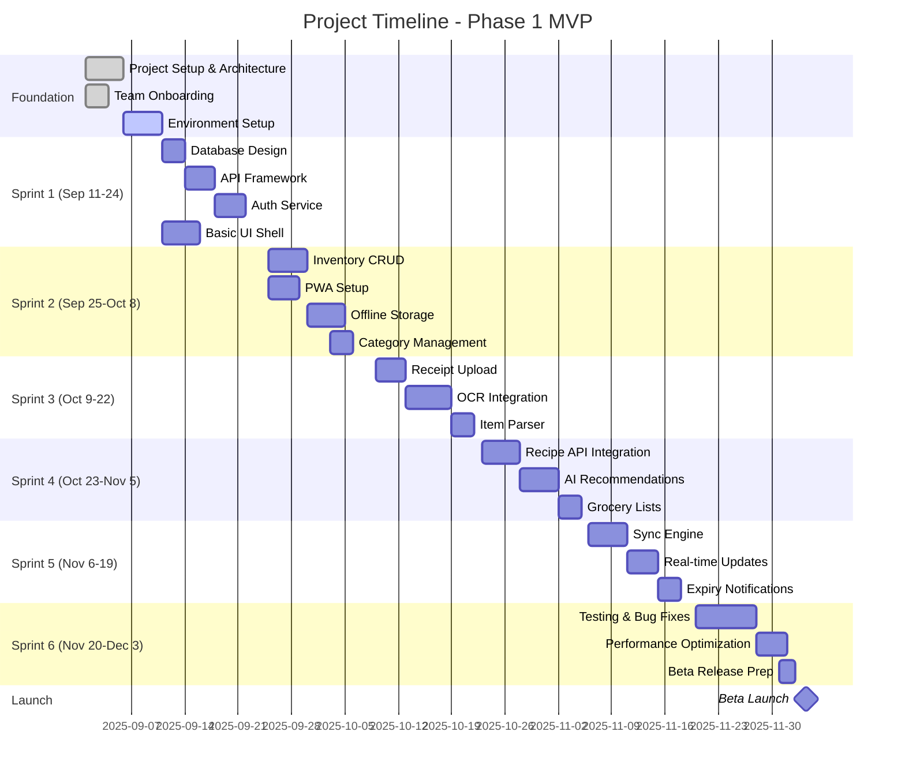
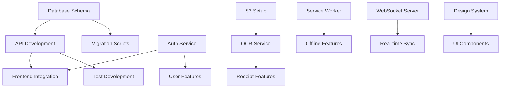

# Task Manager & Implementation Guide
# Pantry & Grocery Management App

**Version:** 1.0  
**Date:** September 2025  
**Status:** Active  
**Document Type:** Task Management & Sprint Planning

---

## Table of Contents
1. [Executive Summary](#1-executive-summary)
2. [Project Timeline Overview](#2-project-timeline-overview)
3. [Team Structure & Responsibilities](#3-team-structure--responsibilities)
4. [Epic Breakdown & User Stories](#4-epic-breakdown--user-stories)
5. [Sprint Planning (Q4 2025)](#5-sprint-planning-q4-2025)
6. [Development Tasks - Phase 1 MVP](#6-development-tasks---phase-1-mvp)
7. [Technical Debt & Refactoring](#7-technical-debt--refactoring)
8. [Testing & QA Tasks](#8-testing--qa-tasks)
9. [DevOps & Infrastructure Tasks](#9-devops--infrastructure-tasks)
10. [Dependencies & Blockers](#10-dependencies--blockers)
11. [Risk Mitigation Tasks](#11-risk-mitigation-tasks)
12. [Definition of Done](#12-definition-of-done)
13. [Task Tracking & Metrics](#13-task-tracking--metrics)

---

## 1. Executive Summary

### 1.1 Project Goals
- Launch MVP by end of Q4 2025 (3 months)
- Achieve 1,000 beta users within first month
- Maintain >95% uptime from day one
- Complete core features: inventory management, receipt scanning, basic recipes

### 1.2 Current Status
- **Overall Progress:** 0% (Project Kickoff)
- **Team Size:** 8 developers, 2 designers, 2 QA, 1 PM, 1 DevOps
- **Sprint Cadence:** 2-week sprints
- **Total Story Points (Phase 1):** 480 points
- **Velocity Target:** 80 points/sprint

### 1.3 Critical Path Items
1. Database schema and API framework setup
2. PWA foundation with offline capability
3. OCR pipeline implementation
4. Core CRUD operations for pantry items
5. Authentication and user management

---

## 2. Project Timeline Overview



---

## 3. Team Structure & Responsibilities

### 3.1 Team Organization

| Role | Name | Primary Responsibilities | Current Sprint Focus |
|------|------|-------------------------|---------------------|
| **Tech Lead** | TBD | Architecture, code reviews, technical decisions | Setup & foundation |
| **Backend Dev 1** | TBD | API services, database | Auth service |
| **Backend Dev 2** | TBD | OCR pipeline, ML integration | Research OCR options |
| **Backend Dev 3** | TBD | Sync service, real-time | WebSocket setup |
| **Frontend Dev 1** | TBD | PWA setup, offline capability | Service workers |
| **Frontend Dev 2** | TBD | UI components, state management | Component library |
| **Frontend Dev 3** | TBD | Recipe features, scanner UI | UI prototypes |
| **Full-Stack Dev** | TBD | Integration, testing | API integration |
| **UI/UX Designer 1** | TBD | Design system, mockups | Design system |
| **UI/UX Designer 2** | TBD | User flows, prototypes | User testing |
| **QA Engineer 1** | TBD | Test automation, E2E | Test framework |
| **QA Engineer 2** | TBD | Manual testing, UAT | Test cases |
| **DevOps Engineer** | TBD | Infrastructure, CI/CD | Environment setup |
| **Product Manager** | TBD | Requirements, stakeholder management | Sprint planning |

### 3.2 RACI Matrix

| Task Category | Tech Lead | Backend | Frontend | QA | DevOps | PM |
|--------------|-----------|---------|----------|-------|--------|-----|
| Architecture Decisions | R | C | C | I | C | I |
| API Development | A | R | C | C | I | I |
| UI Development | A | I | R | C | I | C |
| Testing | C | C | C | R | I | A |
| Deployment | C | I | I | C | R | A |
| Requirements | C | I | I | I | I | R |

*R=Responsible, A=Accountable, C=Consulted, I=Informed*

---

## 4. Epic Breakdown & User Stories

### 4.1 Epic Structure

```yaml
epics:
  EPIC-001:
    title: "User Management & Authentication"
    priority: P0
    story_points: 40
    status: In Progress
    
  EPIC-002:
    title: "Pantry Inventory Management"
    priority: P0
    story_points: 80
    status: To Do
    
  EPIC-003:
    title: "Receipt Scanning & OCR"
    priority: P0
    story_points: 100
    status: To Do
    
  EPIC-004:
    title: "Recipe Recommendations"
    priority: P1
    story_points: 60
    status: To Do
    
  EPIC-005:
    title: "Offline Sync & PWA"
    priority: P0
    story_points: 80
    status: To Do
    
  EPIC-006:
    title: "Grocery Lists"
    priority: P1
    story_points: 40
    status: To Do
    
  EPIC-007:
    title: "Notifications & Alerts"
    priority: P2
    story_points: 30
    status: To Do
    
  EPIC-008:
    title: "Analytics & Reporting"
    priority: P2
    story_points: 50
    status: Backlog
```

### 4.2 User Story Breakdown (Sample)

```markdown
## EPIC-002: Pantry Inventory Management

### USER-021: Add Item to Pantry
**Points:** 5
**Priority:** P0
**Acceptance Criteria:**
- User can add item with name, quantity, category
- Item saves to database
- Item appears in pantry list
- Works offline with sync later

**Tasks:**
- [ ] Create AddItem component (3h)
- [ ] Implement form validation (2h)
- [ ] Create API endpoint (2h)
- [ ] Add database migration (1h)
- [ ] Write unit tests (2h)
- [ ] Write integration tests (2h)

### USER-022: View Pantry Items
**Points:** 3
**Priority:** P0
**Acceptance Criteria:**
- Display all items in grid/list view
- Show quantity and expiry status
- Support search and filter
- Responsive design

**Tasks:**
- [ ] Create PantryGrid component (4h)
- [ ] Implement search functionality (2h)
- [ ] Add filter dropdowns (2h)
- [ ] Style responsive layout (3h)
- [ ] Add loading states (1h)
```

---

## 5. Sprint Planning (Q4 2025)

### 5.1 Sprint 1 (Sep 11-24) - Foundation
**Goal:** Set up core infrastructure and authentication

| ID | Task | Assignee | Points | Status | Dependencies |
|----|------|----------|--------|--------|--------------|
| T001 | Set up PostgreSQL database | Backend-1 | 3 | To Do | - |
| T002 | Configure Redis cache | DevOps | 2 | To Do | T001 |
| T003 | Create database schema | Backend-1 | 5 | To Do | T001 |
| T004 | Set up API Gateway (Express) | Backend-1 | 3 | To Do | - |
| T005 | Implement JWT authentication | Backend-1 | 5 | To Do | T004 |
| T006 | Create user registration endpoint | Backend-1 | 3 | To Do | T005 |
| T007 | Create login endpoint | Backend-1 | 3 | To Do | T005 |
| T008 | Set up React project | Frontend-1 | 2 | To Do | - |
| T009 | Configure Tailwind CSS | Frontend-2 | 2 | To Do | T008 |
| T010 | Create auth UI components | Frontend-2 | 5 | To Do | T009 |
| T011 | Set up Docker containers | DevOps | 3 | To Do | - |
| T012 | Configure CI/CD pipeline | DevOps | 5 | To Do | T011 |
| T013 | Create test framework | QA-1 | 3 | To Do | - |
| T014 | Write auth test cases | QA-2 | 3 | To Do | T013 |

**Total Points:** 46

### 5.2 Sprint 2 (Sep 25-Oct 8) - Core CRUD & PWA
**Goal:** Implement basic inventory management and PWA setup

| ID | Task | Assignee | Points | Status | Dependencies |
|----|------|----------|--------|--------|--------------|
| T015 | Create Item model & repository | Backend-1 | 3 | To Do | - |
| T016 | CRUD endpoints for items | Backend-1 | 5 | To Do | T015 |
| T017 | Category management API | Backend-1 | 3 | To Do | - |
| T018 | Set up Service Worker | Frontend-1 | 5 | To Do | - |
| T019 | Configure PWA manifest | Frontend-1 | 2 | To Do | - |
| T020 | Implement IndexedDB wrapper | Frontend-1 | 5 | To Do | - |
| T021 | Create AddItem component | Frontend-2 | 3 | To Do | - |
| T022 | Create ItemList component | Frontend-2 | 3 | To Do | - |
| T023 | Implement offline queue | Frontend-1 | 5 | To Do | T020 |
| T024 | Create background sync | Frontend-1 | 5 | To Do | T023 |
| T025 | Set up Kubernetes configs | DevOps | 5 | To Do | - |
| T026 | Write CRUD integration tests | QA-1 | 3 | To Do | T016 |
| T027 | PWA installation testing | QA-2 | 3 | To Do | T019 |

**Total Points:** 50

### 5.3 Sprint 3 (Oct 9-22) - Receipt Scanning
**Goal:** Implement receipt upload and OCR processing

| ID | Task | Assignee | Points | Status | Dependencies |
|----|------|----------|--------|--------|--------------|
| T028 | Set up S3 bucket for images | DevOps | 2 | To Do | - |
| T029 | Create file upload endpoint | Backend-1 | 3 | To Do | T028 |
| T030 | Integrate AWS Textract | Backend-2 | 8 | To Do | T028 |
| T031 | Build receipt parser | Backend-2 | 8 | To Do | T030 |
| T032 | Create OCR queue processor | Backend-2 | 5 | To Do | T030 |
| T033 | Implement job status API | Backend-2 | 3 | To Do | T032 |
| T034 | Create camera component | Frontend-3 | 5 | To Do | - |
| T035 | Build receipt preview UI | Frontend-3 | 3 | To Do | T034 |
| T036 | Create processing status UI | Frontend-3 | 3 | To Do | - |
| T037 | Add receipt history view | Frontend-3 | 3 | To Do | - |
| T038 | OCR accuracy testing | QA-1 | 5 | To Do | T031 |
| T039 | Receipt upload E2E tests | QA-2 | 3 | To Do | T035 |

**Total Points:** 51

### 5.4 Sprint 4 (Oct 23-Nov 5) - AI & Recipes
**Goal:** Integrate recipe recommendations and grocery lists

| ID | Task | Assignee | Points | Status | Dependencies |
|----|------|----------|--------|--------|--------------|
| T040 | Integrate Spoonacular API | Backend-2 | 5 | To Do | - |
| T041 | Build recommendation engine | Backend-2 | 8 | To Do | T040 |
| T042 | Create recipe matching algorithm | Backend-2 | 5 | To Do | T041 |
| T043 | Implement Claude API integration | Backend-2 | 5 | To Do | - |
| T044 | Grocery list CRUD API | Backend-3 | 5 | To Do | - |
| T045 | List sharing endpoints | Backend-3 | 3 | To Do | T044 |
| T046 | Recipe suggestion UI | Frontend-3 | 5 | To Do | - |
| T047 | Recipe detail view | Frontend-3 | 3 | To Do | T046 |
| T048 | Grocery list UI | Frontend-2 | 5 | To Do | - |
| T049 | Shopping mode interface | Frontend-2 | 3 | To Do | T048 |
| T050 | Recipe recommendation tests | QA-1 | 3 | To Do | T042 |

**Total Points:** 50

### 5.5 Sprint 5 (Nov 6-19) - Sync & Real-time
**Goal:** Implement real-time sync and notifications

| ID | Task | Assignee | Points | Status | Dependencies |
|----|------|----------|--------|--------|--------------|
| T051 | WebSocket server setup | Backend-3 | 5 | To Do | - |
| T052 | Implement CRDT sync logic | Backend-3 | 8 | To Do | T051 |
| T053 | Conflict resolution engine | Backend-3 | 5 | To Do | T052 |
| T054 | Expiry monitoring service | Backend-1 | 5 | To Do | - |
| T055 | Push notification service | Backend-1 | 5 | To Do | - |
| T056 | WebSocket client integration | Frontend-1 | 5 | To Do | T051 |
| T057 | Real-time UI updates | Frontend-1 | 3 | To Do | T056 |
| T058 | Notification preferences UI | Frontend-2 | 3 | To Do | - |
| T059 | Sync status indicator | Frontend-1 | 2 | To Do | T056 |
| T060 | Sync testing scenarios | QA-1 | 5 | To Do | T052 |
| T061 | Notification testing | QA-2 | 3 | To Do | T055 |

**Total Points:** 49

### 5.6 Sprint 6 (Nov 20-Dec 3) - Polish & Launch
**Goal:** Bug fixes, performance optimization, and beta preparation

| ID | Task | Assignee | Points | Status | Dependencies |
|----|------|----------|--------|--------|--------------|
| T062 | Performance profiling | Full-Stack | 5 | To Do | - |
| T063 | Database query optimization | Backend-1 | 5 | To Do | T062 |
| T064 | API response caching | Backend-1 | 3 | To Do | - |
| T065 | Frontend bundle optimization | Frontend-1 | 5 | To Do | T062 |
| T066 | Image lazy loading | Frontend-2 | 3 | To Do | - |
| T067 | Security audit | DevOps | 5 | To Do | - |
| T068 | Load testing | QA-1 | 5 | To Do | - |
| T069 | UAT with beta users | QA-2 | 5 | To Do | - |
| T070 | Bug fixes (reserved) | All | 8 | To Do | - |
| T071 | Documentation updates | Tech Lead | 3 | To Do | - |
| T072 | Production deployment | DevOps | 5 | To Do | All |

**Total Points:** 52

---

## 6. Development Tasks - Phase 1 MVP

### 6.1 Backend Development Tasks

```yaml
backend_tasks:
  database:
    - task: "Design and implement database schema"
      priority: P0
      effort: 8h
      dependencies: []
      
    - task: "Create migration scripts"
      priority: P0
      effort: 4h
      dependencies: ["database schema"]
      
    - task: "Set up connection pooling"
      priority: P1
      effort: 2h
      dependencies: ["database setup"]
      
  api_development:
    authentication:
      - task: "Implement OAuth 2.0 flow"
        priority: P0
        effort: 8h
        
      - task: "Create JWT token management"
        priority: P0
        effort: 4h
        
      - task: "Build password reset flow"
        priority: P1
        effort: 4h
        
    inventory:
      - task: "Create item CRUD endpoints"
        priority: P0
        effort: 6h
        
      - task: "Implement batch operations"
        priority: P1
        effort: 4h
        
      - task: "Add search and filter APIs"
        priority: P1
        effort: 4h
        
    ocr:
      - task: "Build receipt upload handler"
        priority: P0
        effort: 4h
        
      - task: "Integrate OCR service"
        priority: P0
        effort: 12h
        
      - task: "Create parsing algorithms"
        priority: P0
        effort: 16h
        
    recipes:
      - task: "Integrate recipe API"
        priority: P1
        effort: 6h
        
      - task: "Build recommendation engine"
        priority: P1
        effort: 12h
        
      - task: "Create ingredient matching"
        priority: P1
        effort: 8h
```

### 6.2 Frontend Development Tasks

```yaml
frontend_tasks:
  pwa_setup:
    - task: "Configure service worker"
      priority: P0
      effort: 8h
      assignee: Frontend-1
      
    - task: "Set up offline storage"
      priority: P0
      effort: 6h
      assignee: Frontend-1
      
    - task: "Implement background sync"
      priority: P0
      effort: 8h
      assignee: Frontend-1
      
  ui_components:
    common:
      - task: "Create design system"
        priority: P0
        effort: 12h
        assignee: Frontend-2
        
      - task: "Build form components"
        priority: P0
        effort: 8h
        assignee: Frontend-2
        
      - task: "Create loading states"
        priority: P1
        effort: 4h
        assignee: Frontend-2
        
    pantry:
      - task: "Item card component"
        priority: P0
        effort: 4h
        assignee: Frontend-3
        
      - task: "Grid/List view toggle"
        priority: P1
        effort: 3h
        assignee: Frontend-3
        
      - task: "Category filters"
        priority: P1
        effort: 4h
        assignee: Frontend-3
        
    scanner:
      - task: "Camera interface"
        priority: P0
        effort: 8h
        assignee: Frontend-3
        
      - task: "Receipt preview"
        priority: P0
        effort: 4h
        assignee: Frontend-3
        
      - task: "Processing status"
        priority: P0
        effort: 3h
        assignee: Frontend-3
```

### 6.3 Infrastructure Tasks

```yaml
infrastructure_tasks:
  environment_setup:
    - task: "Create development environment"
      priority: P0
      effort: 4h
      status: Complete
      
    - task: "Set up staging environment"
      priority: P0
      effort: 6h
      status: In Progress
      
    - task: "Configure production environment"
      priority: P0
      effort: 8h
      status: To Do
      
  kubernetes:
    - task: "Create deployment manifests"
      priority: P0
      effort: 6h
      
    - task: "Configure auto-scaling"
      priority: P1
      effort: 4h
      
    - task: "Set up ingress controller"
      priority: P0
      effort: 3h
      
  monitoring:
    - task: "Set up Prometheus"
      priority: P1
      effort: 4h
      
    - task: "Configure Grafana dashboards"
      priority: P1
      effort: 6h
      
    - task: "Implement log aggregation"
      priority: P1
      effort: 4h
```

---

## 7. Technical Debt & Refactoring

### 7.1 Technical Debt Register

| ID | Description | Impact | Effort | Priority | Target Sprint |
|----|-------------|--------|--------|----------|---------------|
| TD001 | Refactor authentication to use refresh tokens | Security | 8h | P1 | Sprint 4 |
| TD002 | Optimize database queries with proper indexing | Performance | 6h | P1 | Sprint 6 |
| TD003 | Implement proper error boundaries in React | Stability | 4h | P2 | Sprint 5 |
| TD004 | Add request rate limiting to all endpoints | Security | 4h | P1 | Sprint 3 |
| TD005 | Refactor OCR parser for better accuracy | Quality | 12h | P2 | Sprint 5 |
| TD006 | Implement proper logging strategy | Debugging | 6h | P2 | Sprint 4 |
| TD007 | Add database connection retry logic | Reliability | 3h | P1 | Sprint 2 |
| TD008 | Optimize bundle size with code splitting | Performance | 8h | P2 | Sprint 6 |

### 7.2 Code Quality Tasks

```markdown
## Code Quality Checklist

### Every Sprint
- [ ] Code coverage > 80%
- [ ] No critical security vulnerabilities
- [ ] All linting errors resolved
- [ ] Performance budget maintained
- [ ] Documentation updated

### Sprint 3 Checkpoint
- [ ] Architecture review
- [ ] Security audit
- [ ] Performance baseline established
- [ ] Accessibility audit (WCAG 2.1 AA)

### Sprint 6 (Pre-launch)
- [ ] Full security penetration test
- [ ] Load testing completed
- [ ] All P0 and P1 bugs resolved
- [ ] Documentation complete
- [ ] Runbooks prepared
```

---

## 8. Testing & QA Tasks

### 8.1 Test Coverage Requirements

```yaml
test_coverage:
  unit_tests:
    backend:
      target: 85%
      current: 0%
      tasks:
        - "Auth service tests" # 20 tests
        - "Inventory service tests" # 35 tests
        - "OCR service tests" # 25 tests
        - "Recipe service tests" # 20 tests
        
    frontend:
      target: 80%
      current: 0%
      tasks:
        - "Component tests" # 40 tests
        - "Hook tests" # 15 tests
        - "Utility tests" # 10 tests
        - "Store tests" # 20 tests
        
  integration_tests:
    target: 30 scenarios
    current: 0
    priority_scenarios:
      - "User registration and login flow"
      - "Add item offline and sync"
      - "Receipt scan to pantry update"
      - "Recipe recommendation flow"
      - "Grocery list creation and sharing"
      
  e2e_tests:
    target: 15 flows
    current: 0
    critical_paths:
      - "Complete onboarding"
      - "Add items manually"
      - "Scan receipt"
      - "Get recipe suggestions"
      - "Create grocery list"
      - "Offline mode operations"
```

### 8.2 QA Task Schedule

| Week | Focus Area | Tasks | Assignee |
|------|------------|-------|----------|
| Week 1-2 | Test Framework | Set up Jest, Playwright, test DB | QA-1 |
| Week 3-4 | Auth Testing | Login, registration, password reset | QA-2 |
| Week 5-6 | CRUD Testing | Item operations, categories | QA-1 |
| Week 7-8 | OCR Testing | Receipt processing accuracy | QA-2 |
| Week 9-10 | Recipe Testing | Recommendations, matching | QA-1 |
| Week 11-12 | Integration | End-to-end flows, performance | Both |

### 8.3 Bug Tracking Template

```markdown
## Bug Report Template

**Bug ID:** BUG-XXX
**Date:** YYYY-MM-DD
**Reporter:** Name
**Severity:** P0/P1/P2/P3
**Component:** Backend/Frontend/Infrastructure

**Description:**
Brief description of the issue

**Steps to Reproduce:**
1. Step 1
2. Step 2
3. Step 3

**Expected Result:**
What should happen

**Actual Result:**
What actually happens

**Environment:**
- Browser/Device:
- OS:
- Version:

**Screenshots/Logs:**
[Attach if applicable]

**Additional Context:**
Any other relevant information
```

---

## 9. DevOps & Infrastructure Tasks

### 9.1 CI/CD Pipeline Tasks

```yaml
cicd_tasks:
  immediate:
    - task: "Set up GitHub Actions workflows"
      priority: P0
      effort: 4h
      status: In Progress
      
    - task: "Configure automated testing"
      priority: P0
      effort: 3h
      status: To Do
      
    - task: "Set up Docker registry"
      priority: P0
      effort: 2h
      status: To Do
      
  week_2:
    - task: "Implement blue-green deployment"
      priority: P1
      effort: 6h
      
    - task: "Set up rollback procedures"
      priority: P1
      effort: 4h
      
    - task: "Configure secrets management"
      priority: P0
      effort: 3h
      
  ongoing:
    - task: "Optimize build times"
      priority: P2
      effort: 4h
      
    - task: "Set up deployment notifications"
      priority: P2
      effort: 2h
```

### 9.2 Infrastructure Checklist

```markdown
## Infrastructure Readiness Checklist

### Week 1
- [x] AWS/GCP account setup
- [x] Domain registration
- [ ] SSL certificates
- [ ] CDN configuration
- [ ] VPC and networking

### Week 2
- [ ] Kubernetes cluster
- [ ] Database instances
- [ ] Redis cache
- [ ] S3 buckets
- [ ] Load balancers

### Week 3
- [ ] Monitoring stack
- [ ] Log aggregation
- [ ] Backup configuration
- [ ] Disaster recovery plan

### Week 4
- [ ] Security groups
- [ ] WAF rules
- [ ] Auto-scaling policies
- [ ] Cost monitoring

### Pre-Launch
- [ ] Performance testing
- [ ] Security audit
- [ ] Runbook documentation
- [ ] On-call rotation
- [ ] Incident response plan
```

---

## 10. Dependencies & Blockers

### 10.1 Critical Dependencies



### 10.2 Current Blockers

| ID | Blocker | Impact | Teams Affected | Resolution | Status |
|----|---------|--------|---------------|------------|--------|
| B001 | Waiting for OCR API keys | Cannot test OCR | Backend-2, QA | Request from vendor | Pending |
| B002 | Design system not finalized | UI development delayed | Frontend, Design | Design review meeting | Scheduled |
| B003 | Database hosting decision | Cannot provision | Backend, DevOps | Architecture review | In Progress |
| B004 | SSL certificate procurement | Cannot test HTTPS | DevOps, QA | Purchase certificate | To Do |

### 10.3 Risk Register

| Risk | Probability | Impact | Mitigation | Owner |
|------|------------|--------|------------|-------|
| OCR accuracy below target | Medium | High | Multiple OCR providers | Backend-2 |
| Offline sync conflicts | Medium | Medium | CRDT implementation | Backend-3 |
| Performance issues at scale | Low | High | Early load testing | QA-1 |
| Third-party API limits | Medium | Medium | Caching strategy | Backend-1 |
| Team velocity lower than planned | Medium | High | Scope adjustment | PM |

---

## 11. Risk Mitigation Tasks

### 11.1 Risk Mitigation Sprint Tasks

```yaml
risk_mitigation:
  sprint_1:
    - task: "Create rollback procedures"
      risk: "Deployment failures"
      effort: 4h
      owner: DevOps
      
    - task: "Set up error monitoring"
      risk: "Undetected bugs"
      effort: 3h
      owner: DevOps
      
  sprint_2:
    - task: "Implement circuit breakers"
      risk: "Service failures"
      effort: 6h
      owner: Backend-1
      
    - task: "Add retry logic"
      risk: "Network issues"
      effort: 4h
      owner: Backend-3
      
  sprint_3:
    - task: "Performance benchmarking"
      risk: "Slow response times"
      effort: 8h
      owner: QA-1
      
    - task: "Security audit"
      risk: "Security vulnerabilities"
      effort: 8h
      owner: DevOps
```

### 11.2 Contingency Plans

```markdown
## Contingency Planning

### OCR Service Failure
**Primary:** AWS Textract
**Backup:** Google Vision API
**Fallback:** Manual entry UI
**Switch Time:** < 1 hour

### Database Failure
**Primary:** PostgreSQL cluster
**Backup:** Read replica promotion
**Fallback:** Degraded read-only mode
**RTO:** 15 minutes

### Payment Processing
**Primary:** Stripe
**Backup:** PayPal
**Fallback:** Invoice generation
**Switch Time:** < 2 hours

### Recipe API
**Primary:** Spoonacular
**Backup:** Claude API generation
**Fallback:** Basic matching
**Switch Time:** Immediate
```

---

## 12. Definition of Done

### 12.1 Story Completion Criteria

```markdown
## Definition of Done Checklist

### Development Complete
- [ ] Code complete and committed
- [ ] Code reviewed by at least 1 peer
- [ ] Unit tests written and passing (>80% coverage)
- [ ] Integration tests passing
- [ ] No linting errors
- [ ] Documentation updated

### Quality Assurance
- [ ] Tested on all target devices
- [ ] Accessibility requirements met (WCAG 2.1 AA)
- [ ] Performance requirements met
- [ ] Security requirements validated
- [ ] Bug-free in QA environment

### Deployment Ready
- [ ] Deployed to staging
- [ ] Smoke tests passing
- [ ] Product owner approval
- [ ] Release notes prepared
- [ ] Monitoring configured
```

### 12.2 Sprint Completion Criteria

```markdown
## Sprint Definition of Done

### Sprint Goals
- [ ] All committed stories completed
- [ ] Sprint goal achieved
- [ ] No P0 bugs remaining
- [ ] Technical debt not increased

### Quality Metrics
- [ ] Code coverage maintained/improved
- [ ] Performance benchmarks met
- [ ] Zero security vulnerabilities
- [ ] Documentation current

### Team Health
- [ ] Retrospective completed
- [ ] Action items from previous retro addressed
- [ ] Velocity tracked
- [ ] Burndown chart updated
```

---

## 13. Task Tracking & Metrics

### 13.1 Velocity Tracking

```yaml
velocity_metrics:
  sprint_1:
    committed: 46
    completed: TBD
    carried_over: TBD
    
  sprint_2:
    committed: 50
    completed: TBD
    carried_over: TBD
    
  target_velocity: 50
  current_average: TBD
```

### 13.2 Progress Dashboard

```markdown
## Weekly Progress Report Template

### Week of: [Date]

#### Completed This Week
- Story points completed: X/Y
- Major milestones: 
- Blockers resolved:

#### In Progress
- Current sprint: X/6
- Stories in progress: X
- At risk items: X

#### Upcoming
- Next week priorities:
- Dependencies needed:
- Decisions required:

#### Metrics
- Velocity: X points/sprint
- Bug count: P0: X, P1: X, P2: X
- Test coverage: Backend: X%, Frontend: X%
- Build success rate: X%

#### Team Health
- Blockers: X
- Team morale: ⭐⭐⭐⭐☆
- On track for release: Yes/No
```

### 13.3 Task Management Tools Configuration

```yaml
jira_configuration:
  project_key: PANTRY
  
  issue_types:
    - Epic
    - Story
    - Task
    - Bug
    - Spike
    
  workflows:
    states:
      - Backlog
      - To Do
      - In Progress
      - Code Review
      - QA
      - Done
      
  custom_fields:
    - story_points
    - acceptance_criteria
    - technical_notes
    - qa_notes
    
  automation_rules:
    - name: "Auto-assign to QA"
      trigger: "Status changes to QA"
      action: "Assign to QA team member"
      
    - name: "Notify on blockers"
      trigger: "Blocker flag added"
      action: "Send Slack notification"
      
    - name: "Update parent epic"
      trigger: "Story completed"
      action: "Update epic progress"
```

---

## Appendix A: Quick Reference

### A.1 Key Contacts

| Role | Name | Email | Slack | Phone |
|------|------|-------|-------|-------|
| Product Owner | TBD | po@pantryapp.com | @po | xxx-xxx-xxxx |
| Tech Lead | TBD | tech@pantryapp.com | @techlead | xxx-xxx-xxxx |
| DevOps Lead | TBD | devops@pantryapp.com | @devops | xxx-xxx-xxxx |
| QA Lead | TBD | qa@pantryapp.com | @qa | xxx-xxx-xxxx |
| On-Call | Rotating | oncall@pantryapp.com | @oncall | xxx-xxx-xxxx |

### A.2 Important Links

```markdown
## Quick Links

### Development
- GitHub: https://github.com/pantryapp
- CI/CD: https://github.com/pantryapp/actions
- API Docs: https://api.pantryapp.com/docs
- Storybook: https://storybook.pantryapp.com

### Environments
- Dev: https://dev.pantryapp.com
- Staging: https://staging.pantryapp.com
- Production: https://pantryapp.com

### Monitoring
- Grafana: https://grafana.pantryapp.com
- Sentry: https://sentry.io/pantryapp
- Status Page: https://status.pantryapp.com

### Documentation
- Wiki: https://wiki.pantryapp.com
- Runbooks: https://runbooks.pantryapp.com
- Architecture: https://docs.pantryapp.com/architecture
```

### A.3 Sprint Ceremonies Schedule

| Ceremony | Day/Time | Duration | Participants |
|----------|----------|----------|--------------|
| Sprint Planning | Mon 10am | 2h | Entire team |
| Daily Standup | Daily 9:30am | 15m | Entire team |
| Backlog Grooming | Wed 2pm | 1h | PO, Tech Lead, Team Leads |
| Sprint Review | Fri 3pm | 1h | Team + Stakeholders |
| Retrospective | Fri 4pm | 1h | Entire team |

---

## Appendix B: Templates

### B.1 Daily Standup Template

```markdown
## Daily Standup - [Date]

### [Name]
**Yesterday:** 
- Completed [task]
- Progress on [task]

**Today:**
- Will complete [task]
- Starting [task]

**Blockers:**
- [Any blockers]

**Notes:**
- [Any additional context]
```

### B.2 Sprint Review Template

```markdown
## Sprint X Review - [Date]

### Sprint Goal
[Original sprint goal]

### Completed Stories
- [STORY-XXX] Story title (X points)
- [STORY-XXX] Story title (X points)

### Demo Items
1. Feature 1 - [Demo by]
2. Feature 2 - [Demo by]

### Metrics
- Velocity: X/Y points
- Bugs found: X
- Bugs fixed: X

### Feedback
- [Stakeholder feedback]

### Next Sprint Preview
- [Key priorities]
```

---

## Document Control

**Last Updated:** September 2025  
**Next Review:** Weekly during sprints  
**Owner:** Project Manager  
**Distribution:** All team members, stakeholders

**Version History:**
- v1.0 - Initial task breakdown and sprint planning
- v1.1 - Added dependencies and risk mitigation
- v1.2 - Updated with team assignments

---

*This is a living document that will be updated throughout the project lifecycle. All team members are expected to keep their assigned tasks updated in the project management system.*